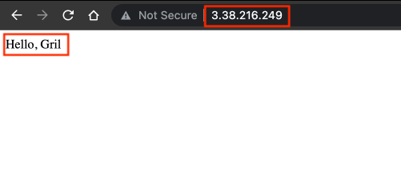

# Terraform 101 Study 1주차

```bash
.
├── 01
│   ├── data.tf
│   ├── ec2.tf
│   ├── output.tf
│   ├── provider.tf
│   ├── terraform.tfstate
│   ├── terraform.tfstate.backup
│   └── var.tf
├── 02
│   ├── 02.dot
│   ├── data.tf
│   ├── ec2.tf
│   ├── output.tf
│   ├── provider.tf
│   └── var.tf
├── 03
│   ├── precondition.tf
│   ├── step0.txt
│   └── terraform.tfstate
├── 04
│   ├── dynamodb.tf
│   ├── output.tf
│   ├── provider.tf
│   ├── s3.tf
│   ├── terraform.tfstate
│   ├── terraform.tfstate.backup
│   └── var.tf
├── README.md
```

## [도전과제1] EC2 웹 서버 배포

1. 변수로 사용할 값들 정의
  
   ```bash
   variable "region" {
     type = string
     description = "aws region"
     default     = "ap-northeast-2"
   }
   
   variable "namespace" {
     type = string
     description = "(optional) describe your variable"
     default = "Gril"
   }
   
   variable "instance_type" {
     type = string
     description = "instance type"
     default     = "t3.large"
   }
   
   variable "key-pair" {
     type = string
     description = "ec2 key pair"
     default     = "terraform"
   }
   ```

2. Ubuntu 최신 이미지 AMI 가져오기

   ```bash
   data "aws_ami" "ubuntu_latest" {
     most_recent = true 
     filter {
       name   = "name"
       values = ["ubuntu/images/hvm-ssd/ubuntu-jammy-22.04-amd64-server*"]
     }
     filter {
       name   = "virtualization-type"
       values = ["hvm"]
     }
     owners = ["099720109477"] 
   }
    ```

3. EC2 Apache 설치 및 Security Group 설정

   ```bash
   resource "aws_instance" "ubuntu-apache" {
     ami                         = data.aws_ami.ubuntu_latest.id
     instance_type               = "${var.instance_type}"
     vpc_security_group_ids      = [aws_security_group.ubuntu-apache-sg.id]
     key_name                    = var.key-pair
     associate_public_ip_address = true
     user_data = <<-EOF
               #!/bin/bash
               sleep 60
               sudo apt-get -y update
               sudo apt-get -y install apache2
               sudo service apache2 start
               echo "Hello, Gril" > /var/www/html/index.html
               EOF
     tags = { Name = "${var.namespace}-ubuntu-apache" }
   }
   
   resource "aws_security_group" "ubuntu-apache-sg" {
     name = "${var.namespace}-sg"
   
     ingress {
       from_port   = 80
       to_port     = 80
       protocol    = "tcp"
       cidr_blocks = ["0.0.0.0/0"]
     }
   
     egress {
       from_port   = 0
       to_port     = 0
       protocol    = "-1"
       cidr_blocks = ["0.0.0.0/0"]
     }
   
     tags = {
       Name = "${var.namespace}-sg"
     }
   }
   ```

4. 배포 및 output 확인

   ```bash
   Apply complete! Resources: 2 added, 0 changed, 0 destroyed.
 
   Outputs:
 
   ubuntu_apache_ip = "3.38.216.249”
 
   ```

5. 웹 페이지 접속 확인

   

## [도전과제4] AWS 서비스 리소스 배포 (S3, Daynamo DB)

> 도전과제2를 수행하기 위해 S3와 DynamoDB를 배포합니다.

1. AWS S3 버킷 및 버전 관리 설정

   ```bash
   resource "aws_s3_bucket" "backend_bucket" {
     bucket = lower("${var.namespace}-terraform-backend")
   }
 
   resource "aws_s3_bucket_versioning" "backend_bucket" {
     bucket = aws_s3_bucket.backend_bucket.id
     versioning_configuration {
       status = "Enabled"
     }
   }
   ```

2. DynamoDB 테이블 설정

   ```bash
   resource "aws_dynamodb_table" "terraform_backend" {
     name         = "${var.namespace}-terraform-backend"
     billing_mode = "PAY_PER_REQUEST"
     hash_key     = "LockID"
 
     attribute {
       name = "LockID"
       type = "S"
     }
   }
   ```

3. 배포 및 output 확인

   ```bash
   $ terraform apply
   ···
   Apply complete! Resources: 3 added, 0 changed, 0 destroyed.
 
   Outputs:
 
   dynamodb_table_name = "Gril-terraform-backend"
   s3_bucket_arn = "arn:aws:s3:::gril-terraform-backend"
   ```

## [도전과제2] AWS S3/DynamoDB 백엔드

Terraform 백엔드란?  
Terraform에서 상태파일은 코드로 관리된 리소스를 탐색하고 추적하는 데 사용됩니다.  
작업자 간의 협업을 위해 상태 파일을 공유하고, 여러 작업자가 동시에 작업할 때 충돌을 방지하기 위해 상태 파일을 잠글 수 있습니다.  
상태 파일을 공유하기 위해 **S3**를 사용하고 상태 파일을 잠그기 위해 **DynamoDB**를 사용합니다.  

> 도전과제1의 `provider.tf`를 수정하여 백엔드를 설정합니다.

1. 이전에 생성한 S3와 DyanamoDB를 이용하여 백엔드 설정

   ```bash
   terraform {
     required_providers {
       aws = {
         source  = "hashicorp/aws"
         version = "~> 4.3"
       }
     }
     backend "s3" {
     bucket         = "gril-terraform-backend"
     key            = "test/terraform.tfstate"
     region         = "ap-northeast-2"
     dynamodb_table = "Gril-terraform-backend"
     }
   }
   ```

2. 배포 및 output 확인

   ```bash
   Apply complete! Resources: 2 added, 0 changed, 0 destroyed.

    Outputs:

    ubuntu_apache_ip = "3.36.129.33"
   ```

3. S3에 Terraform State 파일이 생성되었는지 확인

   
  
4. Terraform Graph 생성 및 확인

   ```bash
   $ terraform graph > 02.dot
   ```

    

## [도전과제3] Lifecycle의 precondition

> 조건: step0.txt ~ step6.txt 총 7개의 파일 이름 중 하나가 일치 시 검증 만족

1. [Contains](https://developer.hashicorp.com/terraform/language/functions/contains) 함수를 사용 (list나 set에 정의된 값 중 하나라도 일치하는 지 확인)

   ```bash
   ···
   lifecycle {
     precondition {
       condition     = contains(["step0.txt", "step1.txt", "step2.txt", "step3.txt", "step4.txt", "step5.txt", "step6.txt"], var.file_name)
       error_message = "file name is not step0~6"
     }
   }
   ···
   ```
