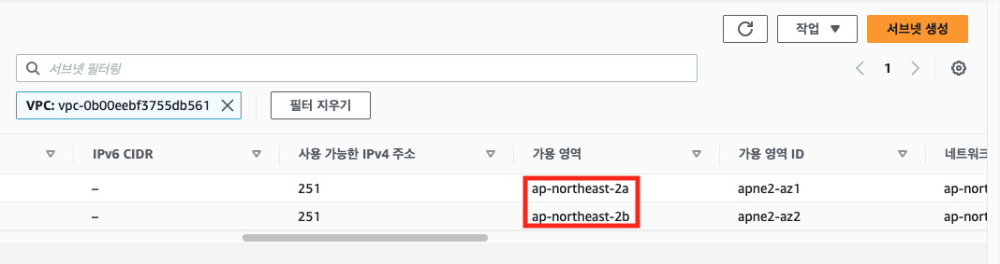
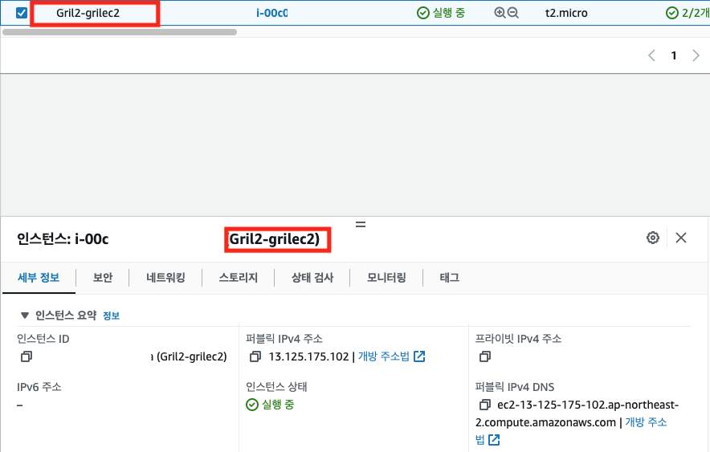
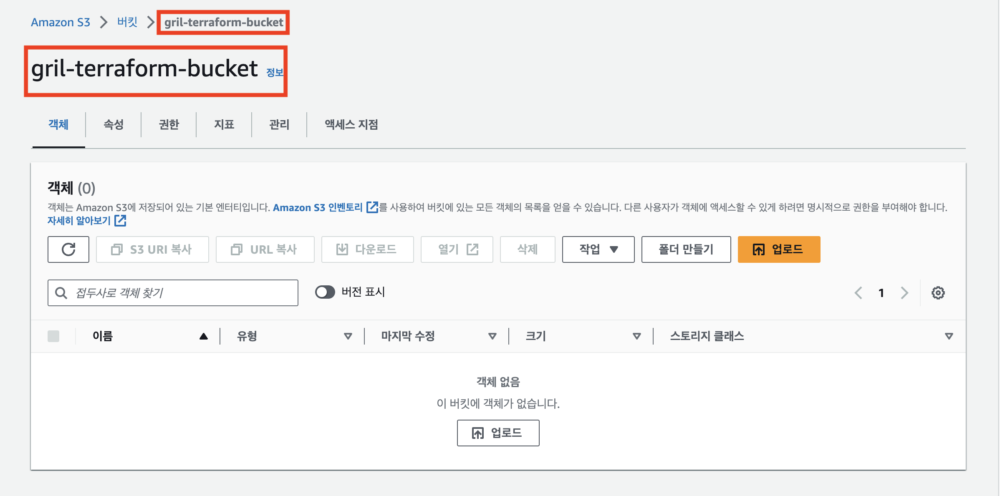
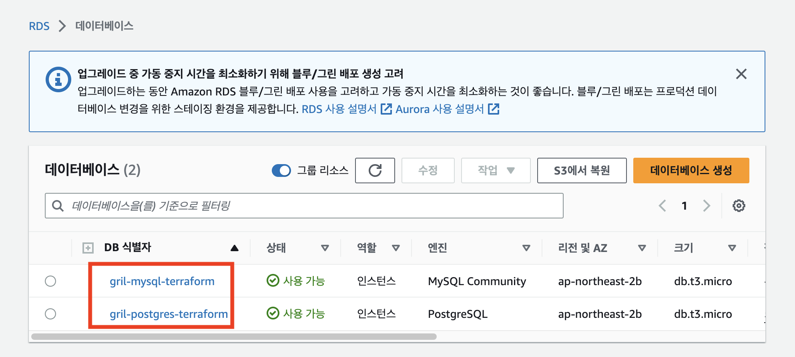
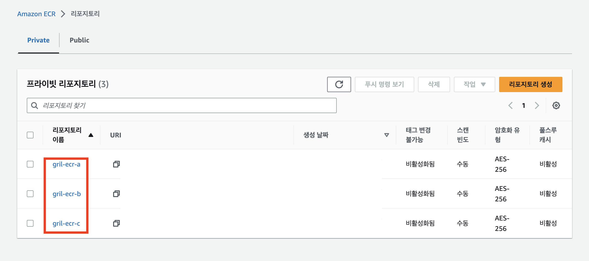
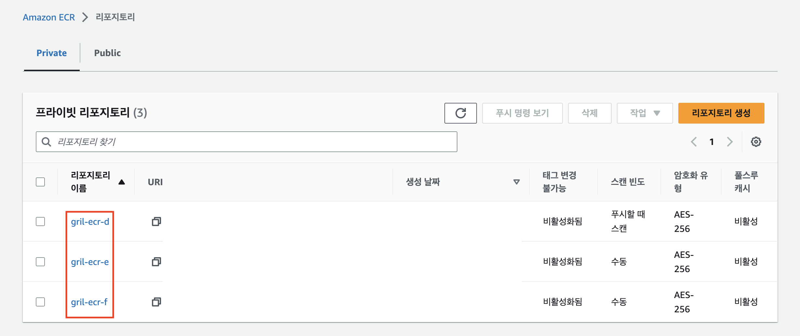
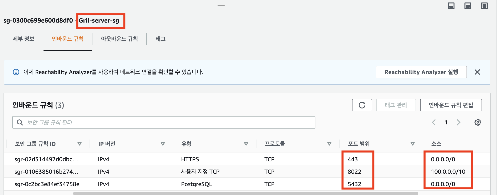
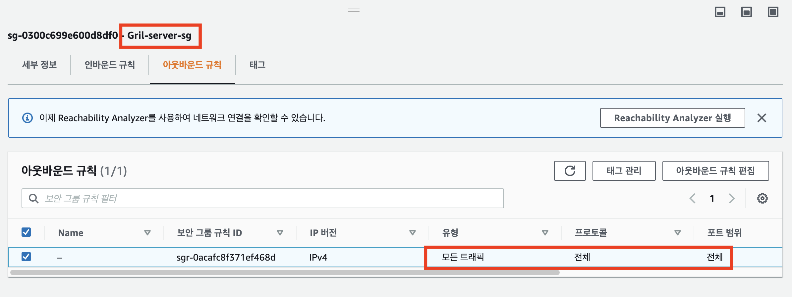

# Terraform 101 Study 2주차 정리 <!-- omit in toc -->

- [Data Source](#data-source)
- [입력 변수 Variable](#입력-변수-variable)
- [Local 지역 값](#local-지역-값)
- [output 출력](#output-출력)
- [반복문](#반복문)
- [도전과제1](#도전과제1)
- [도전과제2](#도전과제2)
- [도전과제3](#도전과제3)
- [도전과제4](#도전과제4)
- [도전과제5](#도전과제5)

<aside class="Positive">
<b>Note:</b> 이 포스팅은 CloudNet@ 팀에서 진행하는 Terraform 101 Study의 2주차 내용을 정리한 글입니다.  

전체 소스 코드는 <a ref="https://github.com/Gril-J/Terraform-101-Study">GitHub</a>에서 확인 가능합니다.  
</aside>

## Data Source

데이터 소스는 Terraform이 관리하는 리소스가 아닌 외부 리소스를 참조하는 기능입니다.
데이터 소스를 정의할 때 사용 가능한 메타 데이터는 다음과 같습니다.

- depends_on : 종속성을 선언하며, 선언된 구성요소와의 생성 시점에 대해 정의
- count : 선언된 개수에 따라 여러 리소스를 생성
- for_each : map 또는 set 타입의 데이터 배열의 값을 기준으로 여러 리소스를 생성
- lifecycle : 리소스의 수명주기 관리

## 입력 변수 Variable

입력 변수는 Terraform 코드를 실행할 때 사용자가 입력하는 값입니다.

- 기본 유형
  - string : 글자 유형
  - number : 숫자 유형
  - bool : true 또는 false
  - any : 명시적으로 모든 유형이 허용됨을 표시
- 집합 유형
  - list (<유형>): 인덱스 기반 집합
  - map (<유형>): 값 = 속성 기반 집합이며 키값 기준 정렬
  - set (<유형>): 값 기반 집합이며 정렬 키값 기준 정렬
  - object ({<인수 이름>=<유형>, …})
  - tuple ([<유형>, …])
- 변수 입력 방식과 우선 순위(**하위 항목이 우선 순위가 높음**)
  - 실행 후 입력
  - variable 블록의 default 값
  - 환경 변수 (TF_VAR 변수 이름)
  - terraform.tfvars에 정의된 변수 선언
  - *.auto.tfvars에 정의된 변수 선언
  - *.auto.tfvars.json에 정의된 변수 선언
  - CLI 실행 시 -var 인수에 지정 또는 -var-file로 파일 지정

## Local 지역 값

코드 내에서 사용자가 지정한 값 또는 속성 값을 가공해 참조 가능한 local (지역 값)은 외부에서 입력되지 않고, 코드 내에서만 가공되어 동작하는 값을 선언할 때 사용합니다.
‘local’은 입력 변수와 달리 선언된 모듈 내에서만 접근 가능하고, 변수처럼 실행 시에 입력받을 수 없습니다.

## output 출력

출력 값은 주로 테라폼 코드의 프로비저닝 수행 후의 결과 속성 값을 확인하는 용도로 사용됩니다.
코드 내 요소 간에 제한된 노출을 지원하듯, 테라폼 모듈 간, 워크스페이스 간 데이터 접근 요소로도 활용할 수 있습니다.

## 반복문

반복문은 Terraform 코드 내에서 반복적으로 수행되는 코드 블록을 정의할 때 사용합니다.

- count: 값이 정수인 인수가 포함된 경우 선언된 정수 값만큼 리소스를 생성
- for_each: 데이터 형태가 map 또는 set이면, 선언된 key 값 개수만큼 리소스를 생성
- for: 복합 형식 값의 형태를 변환하는 데 사용

---

## 도전과제1

### 리전 내에서 사용 가능한 가용영역 목록 가져오기를 사용한 VPC 리소스 생성 실습 진행 <!-- omit in toc -->

1. data source를 사용하여 리전 내에서 사용 가능한 가용영역 목록 가져오기

   ```bash
   data "aws_availability_zones" "available" {
     state = "available"
   }
   ```

2. `terraform state show` 명령어로 생성된 데이터 확인

   ```bash
   terraform state show data.aws_availability_zones.azs      
   # data.aws_availability_zones.azs:
   data "aws_availability_zones" "azs" {
       group_names = [
           "ap-northeast-2",
       ]
       id          = "ap-northeast-2"
       names       = [
           "ap-northeast-2a",
           "ap-northeast-2b",
           "ap-northeast-2c",
           "ap-northeast-2d",
       ]
       state       = "available"
       zone_ids    = [
           "apne2-az1",
           "apne2-az2",
           "apne2-az3",
           "apne2-az4",
       ]
   }
   ```

3. subnet 생성 시 `data.aws_availability_zones.available`을 활용

   ```bash
   resource "aws_subnet" "mysubnet1" {
     vpc_id     = aws_vpc.myvpc.id
     cidr_block = "10.10.1.0/24"
   
     availability_zone = data.aws_availability_zones.azs.names[0]
   
     tags = {
       Name = "${var.namespace}subnet1"
     }
   }
   
   resource "aws_subnet" "mysubnet2" {
     vpc_id     = aws_vpc.myvpc.id
     cidr_block = "10.10.2.0/24"
   
     availability_zone = data.aws_availability_zones.azs.names[1]
   
     tags = {
       Name = "${var.namespace}subnet2"
     }
   }
   ```

4. subnet 배포 확인

   

## 도전과제2

### 리소스의 이름(myvpc, mysubnet1 등)을 자신의 닉네임으로 변경해서 배포 <!-- omit in toc -->

terraform의 resource
배포되는 ressource의 이름이 달르는 것을 확인

1. `var.tf` 파일에 namespace 변수 추가

   ```bash
   variable "namespace" {
     type = string
     description = "(optional) describe your variable"
     default = "Gril2"
   }
   ```

2. terraform으로 선언하는 resource 명칭을 **gril** 닉네임으로 변경

   ```bash
   ··· 
   resource "aws_vpc" "grilvpc" {
     cidr_block       = "10.10.0.0/16"
     enable_dns_support   = true
     enable_dns_hostnames = true
   
     tags = {
       Name = "${var.namespace}study"
     }
   }
   ```

3. 변경한 resource 명칭을 참조하는 속성 값을 올바르게 변경

   ```bash
   resource "aws_internet_gateway" "griligw" {
     vpc_id = aws_vpc.grilvpc.id
   
     tags = {
       Name = "${var.namespace}-igw"
     }
   }
   ```

4. 선언한 resource 명칭과 배포된 실제 이름 확인

   ```bash
   $ terraform state list

   data.aws_ami.gril_amazonlinux2
   data.aws_availability_zones.azs
   aws_instance.grilec2
   aws_internet_gateway.griligw
   aws_route.grildefaultroute
   aws_route_table.grilrt
   aws_route_table_association.grilrtassociation1
   aws_route_table_association.grilrtassociation2
   aws_security_group.grilsg
   aws_security_group_rule.grilsginbound
   aws_security_group_rule.grilsgoutbound
   aws_subnet.grilsubnet1
   aws_subnet.grilsubnet2
   aws_vpc.grilvpc
   ```

    

## 도전과제3

### 입력변수를 활용해서 리소스 배포 <!-- omit in toc -->

1. String 타입의 입력 변수 생성

   ```bash
   variable "namespace" {
     type = string
     default = "Gril"
   }
 
   variable "s3name" {
     type = string
     default = "terraform-bucket"
   }
   ```

2. 입력 변수를 참조하는 S3 리소스 생성

   ```bash
   # namespace와 s3name을 참조하여 소문자로 bucket name을 생성
   resource "aws_s3_bucket" "var_bucket" {
     bucket = lower("${var.namespace}-${var.s3name}")
   }
   
   resource "aws_s3_bucket_versioning" "var_bucket" {
     bucket = aws_s3_bucket.var_bucket.id
     versioning_configuration {
       status = "Enabled"
     }
   }
   ```

3. 배포 및 리소스 확인

   ```bash
      $ terraform apply --auto-approve
      Apply complete! Resources: 2 added, 0 changed, 0 destroyed.
   ```

   

## 도전과제4

### local 변수를 활용해서 리소스 생성 <!-- omit in toc -->

1. 배포할 RDS 속성들이 선언 되어 있는 local 변수 생성

   ```bash
   #local 변수로 각 RDS 설정 값 정의
   locals {
     instance_class = "db.t3.micro"
     rds_instances = {
       "gril-mysql" = {
         identifier           = "gril-mysql-terraform"
         db_name              = "grilmysql"
         engine               = "mysql"
         engine_version       = "8.0.32"
         parameter_group_name = "mysql8"
         port                 = 3306
         username             = "mysqladmin"
       },
       "gril-postgres" = {
         identifier           = "gril-postgres-terraform"
         db_name              = "grilpostgres"
         engine               = "postgres"
         engine_version       = "13.10"
         parameter_group_name = "postgres13"
         port                 = 5432
         username             = "postgresadmin"
       }
     }
   }
   ```

2. Mysql, Postgres Parameter group 생성

   ```bash
   # parameter group 생성
   resource "aws_db_parameter_group" "mysql_parameter_group" {
     name        = "mysql8"
     family      = "mysql8.0"
     description = "Parameter group for MySQL 8"
   }
   
   resource "aws_db_parameter_group" "postgres_parameter_group" {
     name        = "postgres13"
     family      = "postgres13"
     description = "Parameter group for Postgres 13"
   }
   ```

3. RDS Password를 랜덤하게 생성

   ```bash
   ## Random password 생성
   resource "random_password" "rds" {
     length           = 16
     special          = true
   }
   ```

4. 배포 및 리소스 확인

   ```bash
   terraform state list                         
   aws_db_instance.gril_rds["gril-mysql"]
   aws_db_instance.gril_rds["gril-postgres"]
   $ terraform apply --auto-approve
   Apply complete! Resources: 5 added, 0 changed, 0 destroyed.
   ```

   

## 도전과제5

### count, for_each 반복문, for문, dynamic문 을 활용해서 리소스 <!-- omit in toc -->

> count와 for_each를 사용하여 ECR을 배포하고 둘의 차이점을 확인 하고 for을 이용하여 output 데이터를 출력  

1. `var.tf` 파일에 ECR 속성을 정의하는 List, Map 타입의 변수 선언

   ```bash
   # List를 사용하여 변수 선언
   variable "repository_names" {
     type    = list(string)
     default = ["gril-ecr-a", "gril-ecr-b", "gril-ecr-c"]
   }
   
   # Map을 사용하여 변수 선언
   variable "repositories" {
     type = map(object({
       scan_on_push = bool
     }))
     default = {
       "gril-ecr-d" = {
         scan_on_push = true
       },
       "gril-ecr-e" = {
         scan_on_push = false
       },
       "gril-ecr-f" = {
         scan_on_push = true
       }
     }
   }
   ```

2. count를 사용하여 ECR 생성

   ```bash
   #count를 사용하여 리소스 생성
   resource "aws_ecr_repository" "gril_count_ecr" {
     count = length(var.repository_names)
     name  = var.repository_names[count.index]
     tags = {
       Name = var.repository_names[count.index]
     }
   }
   ```

3. for_each를 사용하여 ECR 생성

   ```bash
   # for_each를 사용하여 리소스 생성
   resource "aws_ecr_repository" "gril_foreach_ecr" {
     for_each = var.repositories
     name     = each.key
     image_scanning_configuration {
       scan_on_push = each.value.scan_on_push
     }
     tags = {
       Name = each.key
     }
   }
   ```

4. for을 사용하여 output 데이터 출력

   ```bash
   output "gril_count_ecr" {
     value = {for r in aws_ecr_repository.gril_count_ecr : r.name => r.repository_url}
   }
   
   output "gril_foreach_ecr" {
     value = {for r in aws_ecr_repository.gril_foreach_ecr : r.name => r.repository_url}
   }
   ```

5. 배포 및 리소스 확인
  
   ```bash
   $ terraform apply --auto-approve
   gril_count_ecr = {
     "gril-ecr-a" = "************.dkr.ecr.ap-northeast-2.amazonaws.com/gril-ecr-a"
     "gril-ecr-b" = "************.dkr.ecr.ap-northeast-2.amazonaws.com/gril-ecr-b"
     "gril-ecr-c" = "************.dkr.ecr.ap-northeast-2.amazonaws.com/gril-ecr-c"
   }
   gril_foreach_ecr = {
     "gril-ecr-d" = "************.dkr.ecr.ap-northeast-2.amazonaws.com/gril-ecr-d"
     "gril-ecr-e" = "************.dkr.ecr.ap-northeast-2.amazonaws.com/gril-ecr-e"
     "gril-ecr-f" = "************.dkr.ecr.ap-northeast-2.amazonaws.com/gril-ecr-f"
   } 
   Apply complete! Resources: 6 added, 0 changed, 0 destroyed.

   $ terraform state list
   aws_ecr_repository.gril_count_ecr[0]
   aws_ecr_repository.gril_count_ecr[1]
   aws_ecr_repository.gril_count_ecr[2]
   aws_ecr_repository.gril_foreach_ecr["gril-ecr-d"]
   aws_ecr_repository.gril_foreach_ecr["gril-ecr-e"]
   aws_ecr_repository.gril_foreach_ecr["gril-ecr-f"]
   ```

   count를 활용한 ECR 생성
   
   for_each를 활용한 ECR 생성
   

> for_each와 dynamic을 사용하여 Security Group을 배포  

1. `var.tf`에 Security 속성을 정의하는 object 타입의 변수 선언

   ```bash
   # Object을 사용하여 변수 선언
   variable "grilserveringress" {
     type = list(object({
       from_port   = number
       to_port     = number
       protocol    = string
       cidr_blocks = list(string)
     }))
     default = [
       {
         from_port   = 8022
         to_port     = 8022
         protocol    = "tcp"
         cidr_blocks = ["100.0.0.0/10"]
       },
       {
         from_port   = 443
         to_port     = 443
         protocol    = "tcp"
         cidr_blocks = ["0.0.0.0/0"]
       },
       {
         from_port   = 5432
         to_port     = 5432
         protocol    = "tcp"
         cidr_blocks = ["0.0.0.0/0"]
       }
     ]
   }
   # Object을 사용하여 변수 선언
   variable "grilserveregress" {
     type = list(object({
       from_port   = number
       to_port     = number
       protocol    = string
       cidr_blocks = list(string)
     }))
     default = [
       {
         from_port   = 0
         to_port     = 0
         protocol    = "-1"
         cidr_blocks = ["0.0.0.0/0"]
       }
     ]
   }
   ```

2. dynamic과 for_each를 사용하여 Security Group 생성

   ```bash
   resource "aws_security_group" "grilserver_sg" {
     name        = "${var.namespace}-server-sg"
     description = "${var.namespace}-server-sg"
   
     dynamic "ingress" {
       for_each = var.grilserveringress
       content {
         from_port   = ingress.value.from_port
         to_port     = ingress.value.to_port
         protocol    = ingress.value.protocol
         cidr_blocks = ingress.value.cidr_blocks
       }
     }
     dynamic "egress" {
       for_each = var.grilserveregress
       content {
         from_port   = egress.value.from_port
         to_port     = egress.value.to_port
         protocol    = egress.value.protocol
         cidr_blocks = egress.value.cidr_blocks
       }
     }
     tags = {
       Name = "${var.namespace}-server-sg"
     }
   }
   ```

3. 배포 및 리소스 확인

   **ingress**
    
   **egress**
    