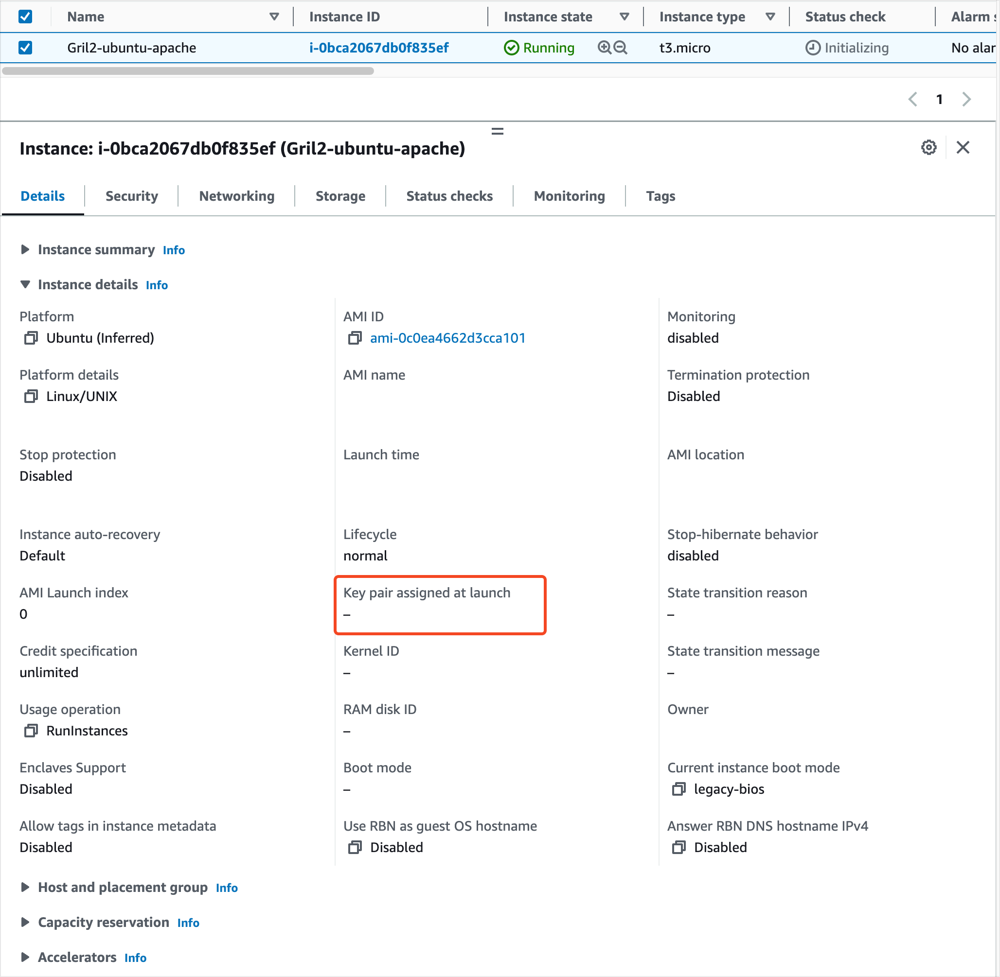
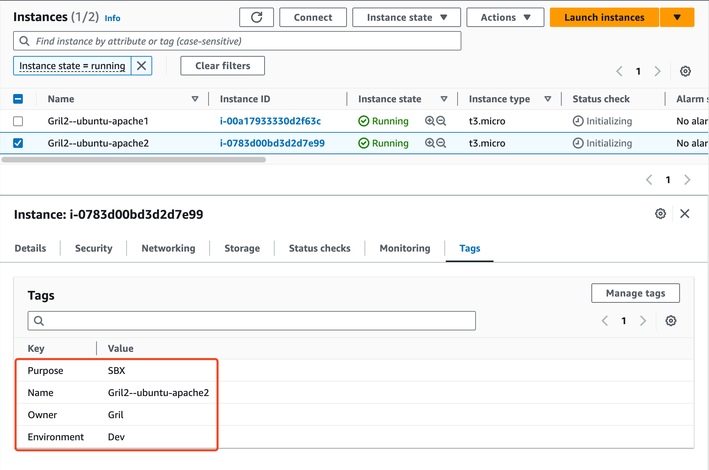
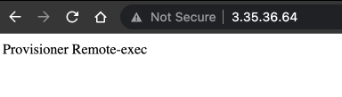
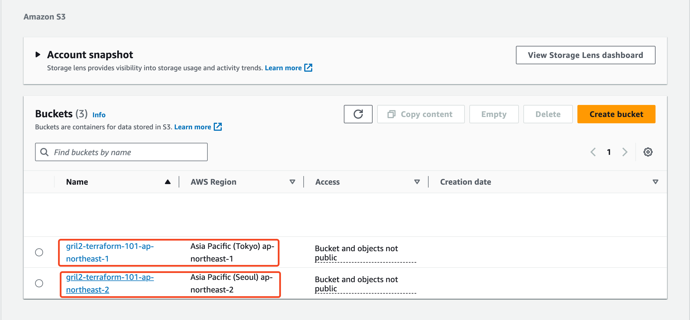

# Terraform 101 Study 3주차 정리 <!-- omit in toc -->
- [조건문](#조건문)
- [함수](#함수)
- [프로비저너](#프로비저너)
- [Terraform\_data](#terraform_data)
- [Moved 블록](#moved-블록)
- [도전과제 1](#도전과제-1)
- [도전과제 2](#도전과제-2)
- [도전과제 3](#도전과제-3)
- [도전과제 4](#도전과제-4)
- [도전과제 5](#도전과제-5)
- [도전과제 6](#도전과제-6)

**Note:** 이 포스팅은 CloudNet@ 팀에서 진행하는 Terraform 101 Study의 2주차 내용을 정리한 글입니다.  

전체 소스 코드는 [GitHub](https://github.com/Gril-J/Terraform-101-Study)에서 확인 가능합니다.  

## 조건문

테라폼에서 조건식은 3항 연사자 형태를 갖습니다.  
일반 적으로 비교 논리 연산자를 사용하여 조건식을 작성합니다.  
조건 식은 ? 기호를 기준으로 **왼쪽은 조건**이며 : 기호를 기준으로  **왼쪽은 조건이 참일 경우** 실행되는 코드이며 **오른쪽은 조건이 거짓일 경우** 실행되는 코드입니다.

```bash
# **<조건 정의>** **?** **<옳은 경우>** : **<틀린 경우>**
**var.a != ""** **?** **var.a** : **"default-a"**
```

## 함수

값의 유형을 변경하거나 조합할 수 있는 내장 함수를 제공합니다.  
단, 내장된 함수 외에 사용자가 구현하는 별도의 사용자 정의 함수를 지원하지는 않습니다.  
테라폼 코드에 함수를 적용하면 변수, 리소스 속성, 데이터 소스 속성, 출력 값 표현 시 작업을 동적이고 효과적으로 수행할 수 있습니다.

관련 된 내장 함수 종류는 다음 [문서](https://developer.hashicorp.com/terraform/language/functions)를 참고하시기 바랍니다.

## 프로비저너

프로바이더로 실행되지 않는 커멘드와 파일 복사 같은 역활을 수행 합니다.  
프로비저너로 실행된 결과는 테라폼의 상태 파일과 동기화되지 않으므로 프로비저닝에 대한 결과가 항상 같다고 보장할 수 없어서 선언적 보장이 되지 않습니다.  
프로비저너 사용을 최소화하는 것이 좋으며 `userdata`, `cloud-init`, `packer`, `chef`, `ansible` 같은 다른 도구를 사용하여 프로비저닝을 수행하는 것이 좋습니다.
프로비전의 종류에는 **file**, **local-exec**, **remote-exec**등이 있습니다.

## Terraform_data

terraform_data는 테라폼 구성에 사용되지 않는 데이터를 제공하는 데 사용됩니다.  
null_resource는 별도의 프로바이더 구성이 필요하지만 terraform_data는 추가 프로바이더 없이 자체에 포함된 **기본 수명주기 관리자**가 제공됩니다.  
강제 재실행을 위한 **trigger_replace**, 상태 저장을 위한 **input**, input에 저장된 값을 출력하는 **output**을 제공합니다.

## Moved 블록

테라폼의 State에 기록되는 리소스 주소의 이름이 변겨오디면 기존 리소스는 삭제 되고 새로운 리소스가 생성됩니다.  
테라폼 리소스를 선언하다보면 리소스 이름 변경, count를 for_each로 전환, 리소스가 모듈로 이동하여 참조된 주소가 변경 등의 상황이 발생합니다.  
리소스의 이름은 변경되지만 프로비저닝된 환경을 그대로 유지하고자 하는 경우 **moved 블록**을 사용하여 리소스를 리팩터링 할 수 있습니다.
테라폼 State에서 옮겨진 대상의 이전 주소와 새 주소를 알리는 역활을 수행하게 됩니다.  

## 도전과제 1

### 조건문을 활용하여 AWS 리소스를 배포하는 코드를 작성 <!-- omit in toc -->

1. `test` 값을 가진 `key-pair` 변수 선언하기

   ```bash
   variable "key-pair" {
     type = string
     description = "ec2 key pair"
     default     = "test"
   }
   ```

2. aws_instance 리소스 key_name 속성에 조건문을 활용 하여 `key-pair` 변수 값이 `terraform` 일 경우에만 `key_name` 속성에 `terraform` 값을 할당

   ```bash
   resource "aws_instance" "ubuntu-apache" {
     ···
     ami                         = data.aws_ami.ubuntu_latest.id
     instance_type               = "${var.instance_type}"
     key_name                    = var.key-pair == "terraform" ? var.key-pair : ""
     associate_public_ip_address = true
     ···
   }
   ```

3. ec2 배포하여 키페어가 할당되었는지 확인

   

## 도전과제 2

### 내장 함수을 활용하여 리소스를 배포하는 코드를 작성 <!-- omit in toc -->

1. `map(string)` 타입의 `gril_tag`` 변수 생성

   ```bash
   ···
   variable "gril_tag" {
     type = map(string)
     description = "value of ec2 tag"
     default     = {
       "Owner" = "Gril"
       "Purpose" = "SBX"
       "Environment" = "Dev"
     }
   }
   ···
   ```

2. aws_instance 리소스에 tag 생성 시 `merge`, `format` 내장 함수를 이용하여 생성

   ```bash
   resource "aws_instance" "ubuntu-apache" {
     ···
     count                       = 2
     ami                         = data.aws_ami.ubuntu_latest.id
     instance_type               = "${var.instance_type}"
     tags = merge(var.gril_tag,
     {
       "Name" = format("%s-%s", var.namespace, "-ubuntu-apache${count.index + 1}")
     })
     ···
   } 
   ```

3. EC2를 배포하여 태그가 정상적으로 생성되었는지 확인

   

## 도전과제 3

### AWS EC2 배포 시 remote-exec/file 프로비저너를 활용하는 코드를 작성 <!-- omit in toc -->

사전에 AWS Console에서 Key Pair를 생성하여 Private Pem 파일을 다운로드 받아야 합니다.

1. 작업 디렉토리에 ec2에 ssh 접속이 가능한 `pem 키`와 ec2 생성시 실행할 `script.sh` 파일을 저장

   ```bash
   vi script.sh
   #!/bin/bash
   sleep 10
   sudo apt-get -y update
   sudo apt-get -y install apache2
   sudo service apache2 start
   echo "Provisioner Remote-exec" > /var/www/html/index.html
   ```

2. aws_instance 리소스에 connection과 provisioner을 활용하여 ssh 접속, 스크립트 복사 및 실행 코드 작성

   ```bash
   resource "aws_instance" "ubuntu-apache" {
   ···
     key_name                    = "terraform"
     connection {
       type     = "ssh"
       user     = "ubuntu"
       private_key = file("${path.module}/terraform.pem")
       host     = aws_instance.ubuntu-apache.public_ip
     }
   
     provisioner "file" {
       source      = "script.sh"
       destination = "/home/ubuntu/script.sh"
     }
   
     provisioner "remote-exec" {
       inline = [
         "chmod +x /home/ubuntu/script.sh",
         "sudo /home/ubuntu/script.sh"
       ]
     }
   } 
   ···
   ```

3. EC2를 배포하여 스크립트가 정상적으로 실행되었는지 확인

   ```bash
   aws_instance.ubuntu-apache: Destroying... [id=i-034c8a305e2e71783]
   aws_instance.ubuntu-apache: Still destroying... [id=i-034c8a305e2e71783, 10s elapsed]
   aws_instance.ubuntu-apache: Still destroying... [id=i-034c8a305e2e71783, 20s elapsed]
   aws_instance.ubuntu-apache: Still destroying... [id=i-034c8a305e2e71783, 30s elapsed]
   aws_instance.ubuntu-apache: Still destroying... [id=i-034c8a305e2e71783, 40s elapsed]
   aws_instance.ubuntu-apache: Destruction complete after 49s
   aws_instance.ubuntu-apache: Creating...
   aws_instance.ubuntu-apache: Still creating... [10s elapsed]
   aws_instance.ubuntu-apache: Provisioning with 'file'...
   aws_instance.ubuntu-apache: Still creating... [20s elapsed]
   aws_instance.ubuntu-apache: Provisioning with 'remote-exec'...
   aws_instance.ubuntu-apache (remote-exec): Connecting to remote host via SSH...
   aws_instance.ubuntu-apache (remote-exec):   Host: 3.35.36.64
   aws_instance.ubuntu-apache (remote-exec):   User: ubuntu
   aws_instance.ubuntu-apache (remote-exec):   Password: false
   aws_instance.ubuntu-apache (remote-exec):   Private key: true
   aws_instance.ubuntu-apache (remote-exec):   Certificate: false
   aws_instance.ubuntu-apache (remote-exec):   SSH Agent: true
   aws_instance.ubuntu-apache (remote-exec):   Checking Host Key: false
   aws_instance.ubuntu-apache (remote-exec):   Target Platform: unix
   aws_instance.ubuntu-apache (remote-exec): Connected!
   aws_instance.ubuntu-apache: Still creating... [30s elapsed]
   aws_instance.ubuntu-apache (remote-exec): 0% [Working]
   ···
   aws_instance.ubuntu-apache (remote-exec): 0 upgraded, 13 newly installed, 0 to remove and 3 not upgraded.
   aws_instance.ubuntu-apache (remote-exec): Need to get 2137 kB of archives.
   aws_instance.ubuntu-apache (remote-exec): After this operation, 8505 kB of additional disk space will be used.
   aws_instance.ubuntu-apache (remote-exec): 0% [Working]
   ···
   aws_instance.ubuntu-apache (remote-exec): (Reading database ... 64312 files and directories currently installed.)
   ···
   ···
   aws_instance.ubuntu-apache (remote-exec): No VM guests are running outdated
   aws_instance.ubuntu-apache (remote-exec):  hypervisor (qemu) binaries on this
   aws_instance.ubuntu-apache (remote-exec):  host.
   aws_instance.ubuntu-apache: Creation complete after 56s [id=i-0bf1671f0d6acf193]
   
   Apply complete! Resources: 1 added, 0 changed, 1 destroyed.
   ```

   

## 도전과제 4

### terraform_data 리소스와 trigger_replace를 활용한 코드 작성 <!-- omit in toc -->

1. terraform_data 리소스를 활용하여 프로비저닝 동작 과정을 확인

   ```bash
   resource "aws_instance" "ubuntu-apache" {
     count                       = 2
   ···
   } 
   
   resource "terraform_data" "null" {
     triggers_replace = [
       aws_instance.ubuntu-apache[0].id,
       aws_instance.ubuntu-apache[1].id
     ]
     input = "Terraform_Data"
   }
   
   output "terraform_data" {
     value = terraform_data.null.output
   }
   ```

2. ec2를 배포하여 terraform_data 리소스가 동작 과정을 확인

   ```bash

   ```bash
   Plan: 3 to add, 0 to change, 0 to destroy.
   
   Changes to Outputs:
     + terraform_data = (known after apply)
   aws_instance.ubuntu-apache[0]: Creating...
   aws_instance.ubuntu-apache[1]: Creating...
   aws_instance.ubuntu-apache[1]: Still creating... [10s elapsed]
   aws_instance.ubuntu-apache[0]: Still creating... [10s elapsed]
   aws_instance.ubuntu-apache[0]: Creation complete after 12s [id=i-0458e35b3a4448de2]
   aws_instance.ubuntu-apache[1]: Creation complete after 12s [id=i-09f9559db468c5f89]
   terraform_data.null: Creating...
   terraform_data.null: Creation complete after 0s [id=65fd3d8c-6c67-75cb-1e1a-697600489a50]
   
   Apply complete! Resources: 3 added, 0 changed, 0 destroyed.
   
   Outputs:
   
   terraform_data = "Terraform_Data"
   ```

## 도전과제 5

### moved 블록을 사용한 테라폼 코드 리팩터링을 수행 <!-- omit in toc -->

리소스가 재생성되지 않고 state만 변경 되는 지 확인

1. aws_instance 리소스를 활용하여 ec2 생성

   ```bash
   resource "aws_instance" "ubuntu-apache1" {
     count                       = 2
   ···
   } 
   ```

2. 리소스를 배포하여 state 확인

   ```bash
   $ terraform apply
   Plan: 2 to add, 0 to change, 0 to destroy.
   aws_instance.ubuntu-apache1[0]: Creating...
   aws_instance.ubuntu-apache1[1]: Creating...
   aws_instance.ubuntu-apache1[1]: Still creating... [10s elapsed]
   aws_instance.ubuntu-apache1[0]: Still creating... [10s elapsed]
   aws_instance.ubuntu-apache1[0]: Creation complete after 12s [id=i-0edbe23c03b0f81f9]
   aws_instance.ubuntu-apache1[1]: Creation complete after 12s [id=i-07c93a9836affcfd2]
   Apply complete! Resources: 2 added, 0 changed, 0 destroyed.
   
   $ terraform state list          
   data.aws_ami.ubuntu_latest
   aws_instance.ubuntu-apache1[0]
   aws_instance.ubuntu-apache1[1]
   ```

3. 1번에서 생성한 aws_instance 리소스 이름을 변경하고 moved 블록을 사용하여 리팩터링

   ```bash
   resource "aws_instance" "ubuntu-apache2" {
     count                       = 2
   ···
   } 

   moved {
     from = aws_instance.ubuntu-apache1
     to = aws_instance.ubuntu-apache2
   }
   ```

4. 리소스를 다시 배포하여 state 확인

   ```bash
   $terraform apply
   data.aws_ami.ubuntu_latest: Reading...
   data.aws_ami.ubuntu_latest: Read complete after 0s [id=ami-0c0ea4662d3cca101]
   aws_instance.ubuntu-apache2[0]: Refreshing state... [id=i-0edbe23c03b0f81f9]
   aws_instance.ubuntu-apache2[1]: Refreshing state... [id=i-07c93a9836affcfd2]
   ···
   Plan: 0 to add, 0 to change, 0 to destroy.
   Apply complete! Resources: 0 added, 0 changed, 0 destroyed.
   $ terraform state list
   terraform state list          
   data.aws_ami.ubuntu_latest
   aws_instance.ubuntu-apache2[0]
   aws_instance.ubuntu-apache2[1]
   ```

## 도전과제 6

### AWS의 S3 버킷을 2개의 리전에서 동작하는 테라폼 코드를 작성 <!-- omit in toc -->

1. 리전이 다른 aws provider를 2개 만들기

   ```bash
   variable "region" {
     type = string
     description = "aws first region"
     default     = "ap-northeast-2"
   }
   
   variable "second_region"{
     type = string
     description = "aws second region"
     default     = "ap-northeast-1"
   }
   ···
   provider "aws" {
     region = var.region
   }
   
   provider "aws" {
     alias = "second_region"
     region = var.second_region
   }
   ```

2. aws_s3_bucket을 활용하여 리전이 다른 s3 버킷 생성하기

   ```bash
   resource "aws_s3_bucket" "bucket_first_region" {
     bucket = lower("${var.namespace}-terraform-101-${var.region}")
   }
   
   resource "aws_s3_bucket" "bucket_second_region" {
     provider = aws.second_region
     bucket   = lower("${var.namespace}-terraform-101-${var.second_region}")
   }
   ```

3. 배포 확인하기


