# Terraform 101 Study 6주차 정리 <!-- omit in toc -->

**Note:** 이 포스팅은 CloudNet@ 팀에서 진행하는 Terraform 101 Study의 6주차 내용을 정리한 글입니다.  

전체 소스 코드는 [GitHub](https://github.com/Gril-J/Terraform-101-Study)에서 확인 가능합니다.  

## 도전과제 1

### TFC의 다양한 기능들과 Private Registry <!-- omit in toc -->

1. Terraform Cloud에 가입 후 Organization을 생성합니다.
   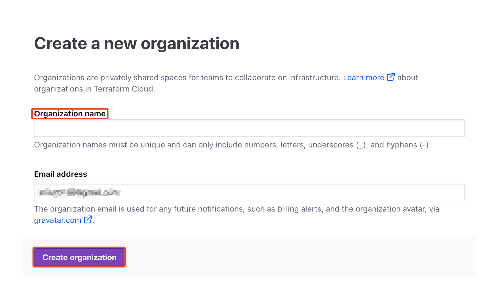
2. terraform 커멘드로 로그인 할 수 있는 Token을 발행합니다.
   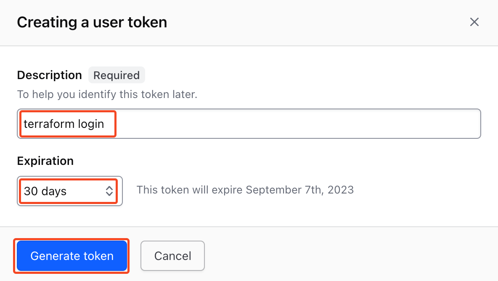
   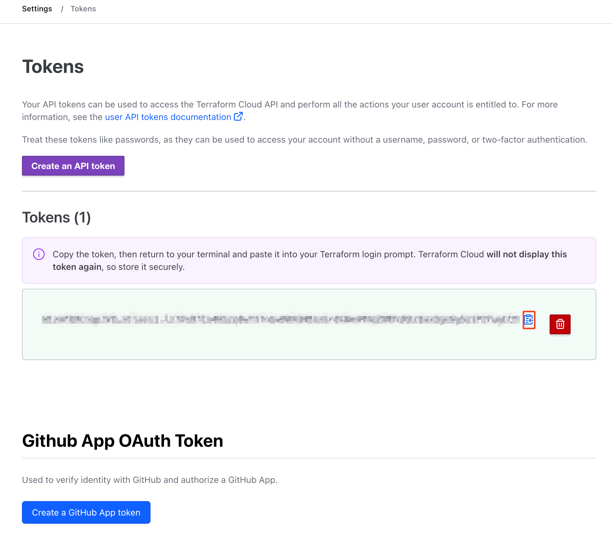
3. state를 terraform cloud로 저장하기 위해 provider를 수정합니다.

   ```hcl
    terraform {
     cloud {
       organization = "<name>"         # 생성한 ORG 이름 지정
       hostname     = "app.terraform.io"      # default
       workspaces {
         name = "terraform-aws-tfc"  
       }
     }
   }
   ```

4. 터미널에서 terraform cloud로 로그인 합니다.

   ```bash
   terraform init
   terraform login # 이전에 발급 받은 토큰 입력
    ---------------------------------------------------------------------------------

                                          -
                                          -----                           -
                                          ---------                      --
                                          ---------  -                -----
                                           ---------  ------        -------
                                             -------  ---------  ----------
                                                ----  ---------- ----------
                                                  --  ---------- ----------
   Welcome to Terraform Cloud!                     -  ---------- -------
                                                      ---  ----- ---
   Documentation: terraform.io/docs/cloud             --------   -
                                                      ----------
                                                      ----------
                                                       ---------
                                                           -----
                                                               -
   ```

5. 생성된 Workspace 확인 하기
   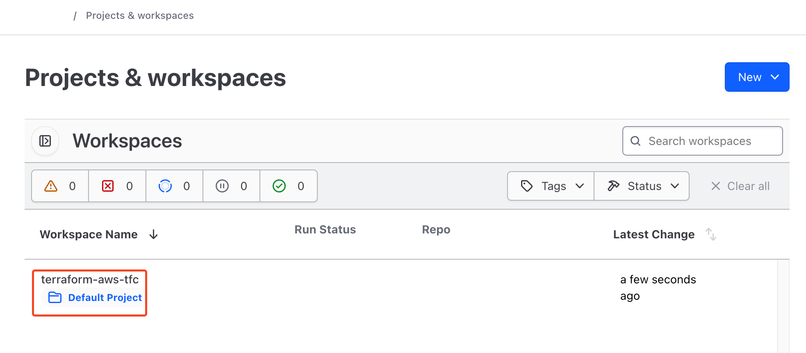

6. Private Registry를 업로드하기 위해 **Registry > Publish > Module** 클릭
   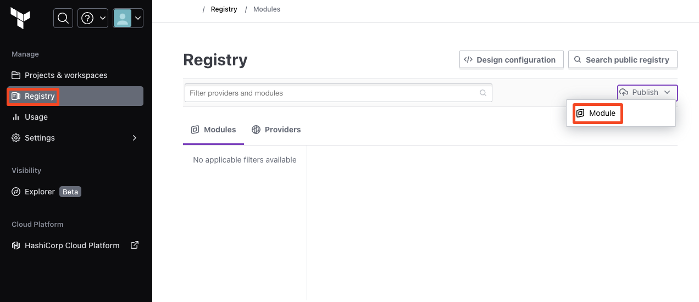

7. 모듈이 저장되어 있는 GitHub와 연결
   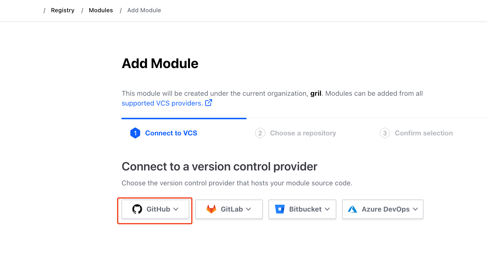
   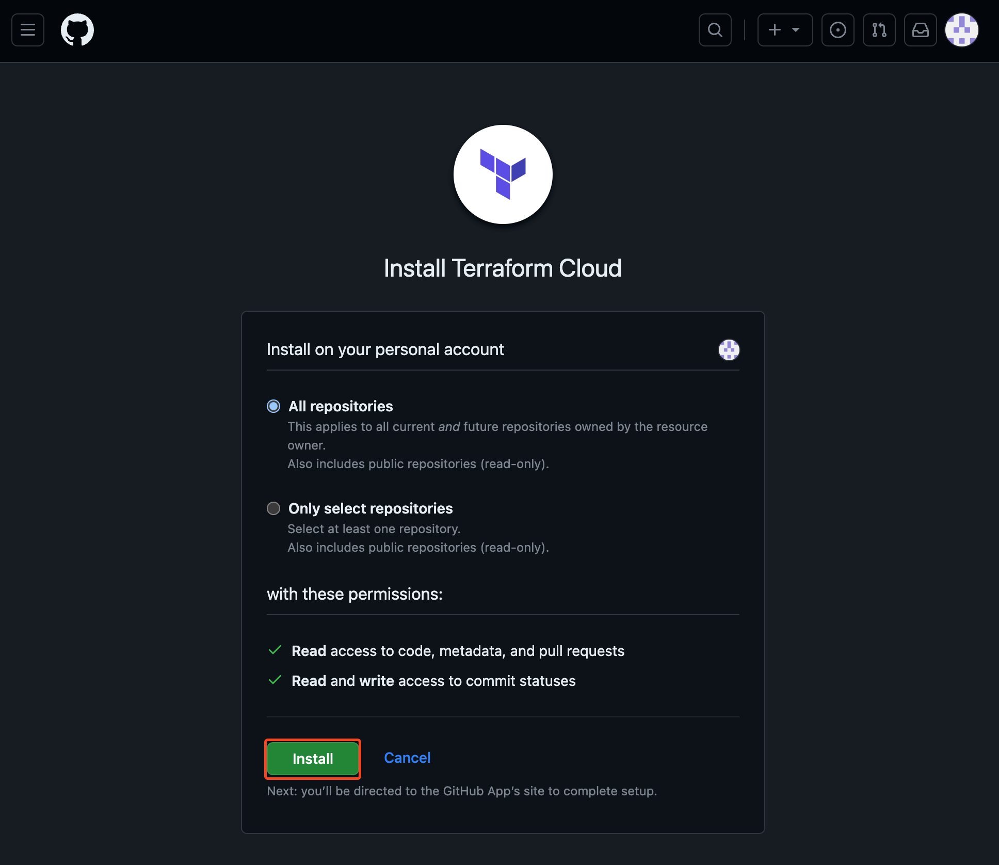

8. Github에 4주차에 만든 모듈을 terraform-<PROVIDER>-<NAME> 형식으로 Public Repo 업로드 후 선택 하기
    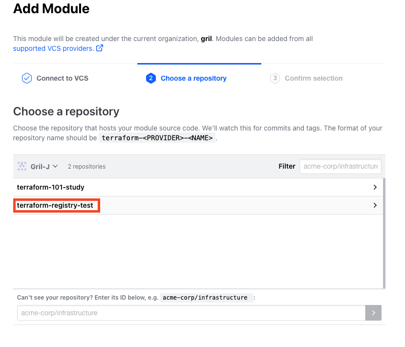

9. 설정한 Private Registry 확인하고 퍼블리싱 하기
   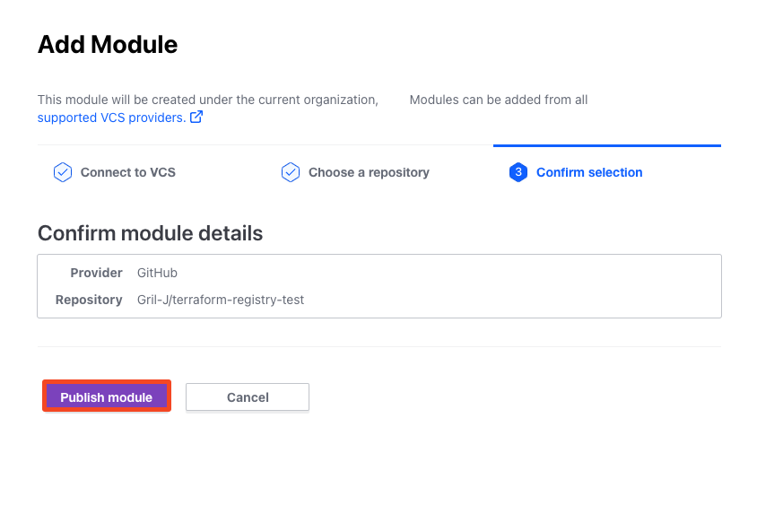

10. 만들어진 Private Registry 확인하기
    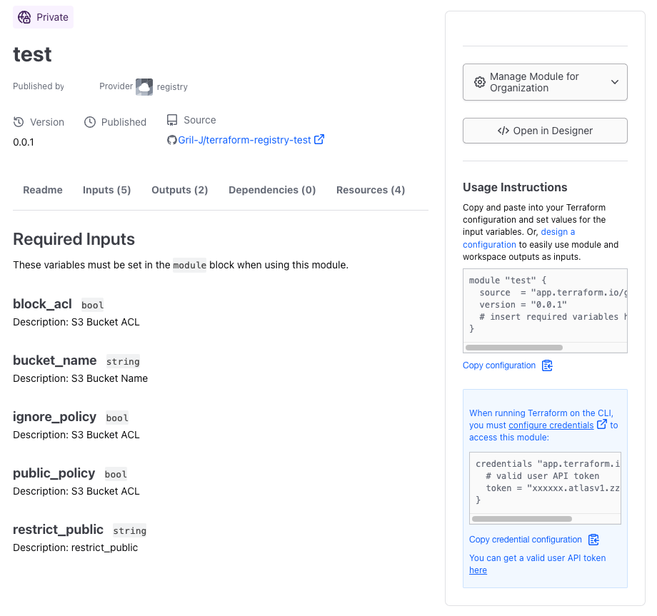

11. 만든 Private Registry를 활용해서 리소스 배포하기

   ```hcl
   module "s3_bucket_module" {
   for_each = toset(var.bucket_name)
   source  = "app.terraform.io/<org>/test/registry"
   version = "0.0.1"
   bucket_name = each.value
   ignore_policy = false
   public_policy = false
   block_acl = false
   restrict_public = false
   }
   ```

12. 리소스 배포 후 이전에 만든 Workspace에 state 저장 확인하기
   

## 실습과제

### 다음 [깃허브 저장소](https://github.com/terraform101/terraform-aws-collaboration)를 복제해 아래 조건에 만족하는 코드를 작성

- Terraform Cloud를 State 백엔드로 구성
  - Workspace 이름 : terraform-edu-part1-assessment
  - 실행 모드는 local
- AWS 공통 Tag : `Project = “workshop”`
- placeholder 변수는 아래 3가지가 각각의 aws_instance에 적용되도록 구성
- EIP를 제거하고 EC2에서 public ip를 자체 사용하도록 구성
- aws_instance는 반복문을 사용해 3개 구성

1. Terraform Cloud를 State로 백엔드 구성 합니다.

   ```hcl
   terraform {
     cloud {
      organization = "<name>"         # 생성한 ORG 이름 지정
      hostname     = "app.terraform.io"      # default
      workspaces {
        name = "terraform-edu-part1-assessment"  
      }
    }
    ···
   }
   ```

2. 공통 Tag과 placeholder 변수를 수정하기 위해 variables.tf 파일을 수정합니다.

   ```hcl
   variable "placeholder" {
     description = "Image-as-a-service URL. Some other fun ones to try are fillmurray.com, placecage.com, placebeard.it, loremflickr.com, baconmockup.com, placeimg.com, placebear.com, placeskull.com, stevensegallery.com, placedog.net"
     default    = {
       kitten = "placekitten.com"
       bear   =  "placebear.com"
       dog    = "placedog.net"
     }
   }
   
   variable "Project" {
     default     = "workshop"
     description = "aws instance tag"
   }
   ```

3. EIP를 제거하기 위해 EIP 관련 리소스를 주석 처리합니다.

   ```hcl
   # resource "aws_eip" "hashicat" {
   #   instance = aws_instance.hashicat.id
   #   vpc      = true
   # }
   
   # resource "aws_eip_association" "hashicat" {
   #   instance_id   = aws_instance.hashicat.id
   #   allocation_id = aws_eip.hashicat.id
   # }
   ```

4. for_each를 활용하여 aws_instance를 구성합니다.

   ```hcl
   resource "aws_instance" "hashicat" {
     for_each = var.placeholder
     ami                         = data.aws_ami.ubuntu.id
     instance_type               = var.instance_type
     key_name                    = aws_key_pair.hashicat.key_name
     associate_public_ip_address = true
     subnet_id                   = aws_subnet.hashicat.id
     vpc_security_group_ids      = [aws_security_group.hashicat.id]
   
     tags = {
       Name = "${var.prefix}-hashicat-instance"
       Project = "${var.Project}"
     }
   }
   ```

5. for_each를 활용하여 null_resource.configure-cat-app을 재구성합니다.

   ```hcl
   resource "null_resource" "configure-cat-app" {
     for_each = var.placeholder
     depends_on = [aws_instance.hashicat]
   
     provisioner "file" {
       source      = "files/"
       destination = "/home/ubuntu/"
   
       connection {
         type        = "ssh"
         user        = "ubuntu"
         private_key = tls_private_key.hashicat.private_key_pem
         host        = aws_instance.hashicat[each.key].public_ip
       }
     }
   
     provisioner "remote-exec" {
       inline = [
         "sudo apt -y update",
         "sleep 15",
         "sudo apt -y update",
         "sudo apt -y install apache2",
         "sudo systemctl start apache2",
         "sudo chown -R ubuntu:ubuntu /var/www/html",
         "chmod +x *.sh",
         "PLACEHOLDER=${each.value} WIDTH=${var.width} HEIGHT=${var.height} PREFIX=${var.prefix} ./deploy_app.sh",
         "sudo apt -y install cowsay",
         "cowsay Mooooooooooo!",
       ]
   
       connection {
         type        = "ssh"
         user        = "ubuntu"
         private_key = tls_private_key.hashicat.private_key_pem
         host        = aws_instance.hashicat[each.key].public_ip
       }
     }
   }
   ```

6. output.tf 파일을 수정하여 public ip와 public dns를 출력합니다.

   ```hcl
   output "catapp_url" {
     value = {for k, v in aws_instance.hashicat : k => "https:://${v.public_dns}"}
   }
   
   output "catapp_ip" {
     value = {for k, v in aws_instance.hashicat : k => "https:://${v.public_ip}"}
   }
   ```

7. 배포하여 Terraform State와 리소스를 확인합니다. 
  
   ```bash
   Apply complete! Resources: 14 added, 0 changed, 0 destroyed.
   
   Outputs:
   
   catapp_ip = {
     "bear" = "https:://<Public IP>"
     "dog" = "https:://<PublicIP>"
     "kitten" = "https:://<Public IP>"
   }
   catapp_url = {
     "bear" = "https:://<Public Dns>.ap-northeast-2.compute.amazonaws.com"
     "dog" = "https:://<Public Dns>.ap-northeast-2.compute.amazonaws.com"
     "kitten" = "https:://<Public Dns>.ap-northeast-2.compute.amazonaws.com"
   }
   ```

   
   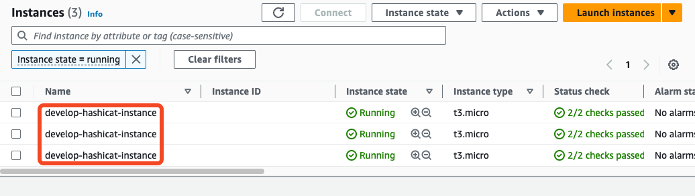

## Terraform License Feature

- [No-Code Provisioning](https://developer.hashicorp.com/terraform/tutorials/cloud/no-code-provisioning)의 경우 Plus Edition이 필요합니다.  
  - No-Code Provisioning 관련 [블로그 링크](https://dev.classmethod.jp/articles/tfc-no-code-provisioning-ga/)
- [Teams](https://developer.hashicorp.com/terraform/cloud-docs/users-teams-organizations/teams)의 경우 Standard Edition이 필요합니다.
  - Teams 관련 [블로그 링크](https://dev.classmethod.jp/articles/update-terraform-cloud-add-project/)
