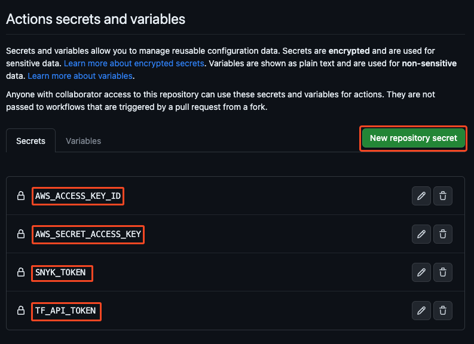
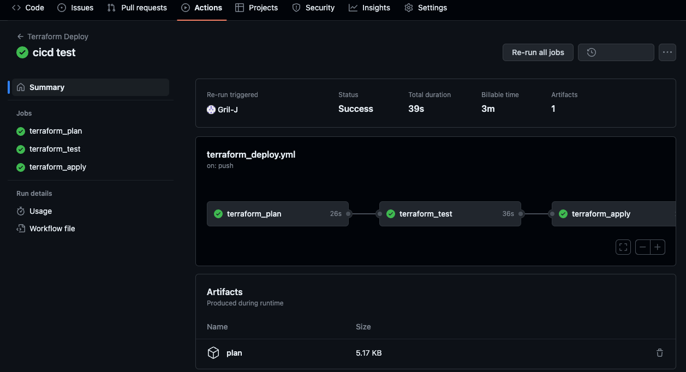
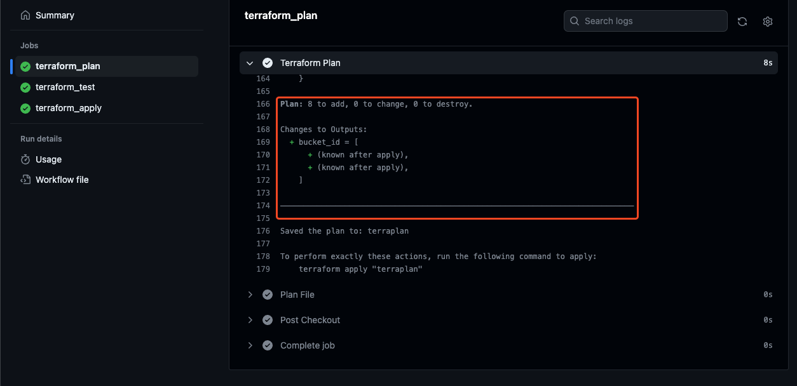
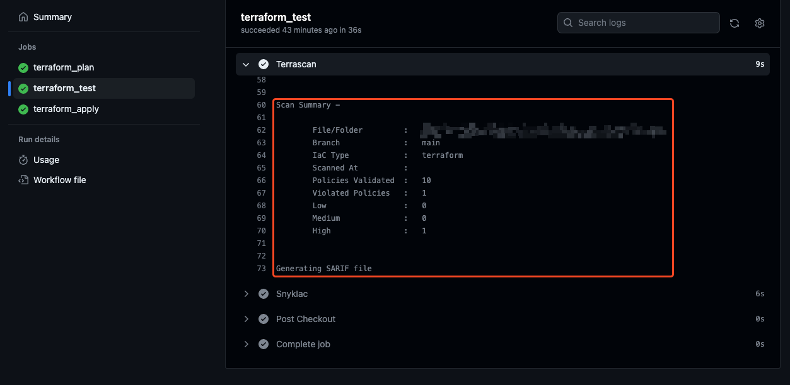
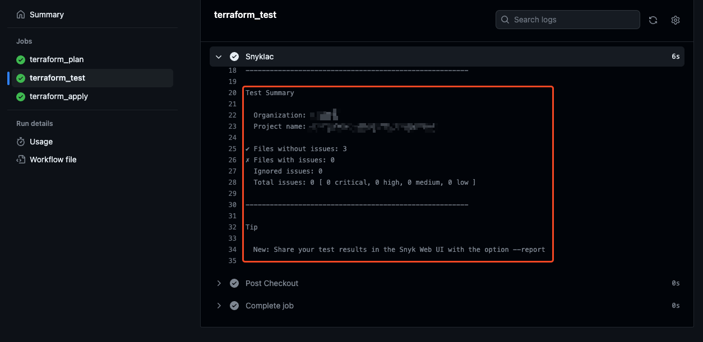
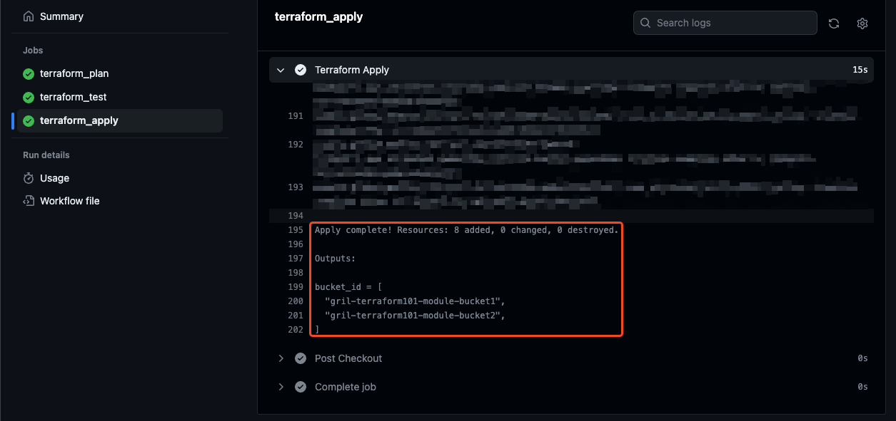
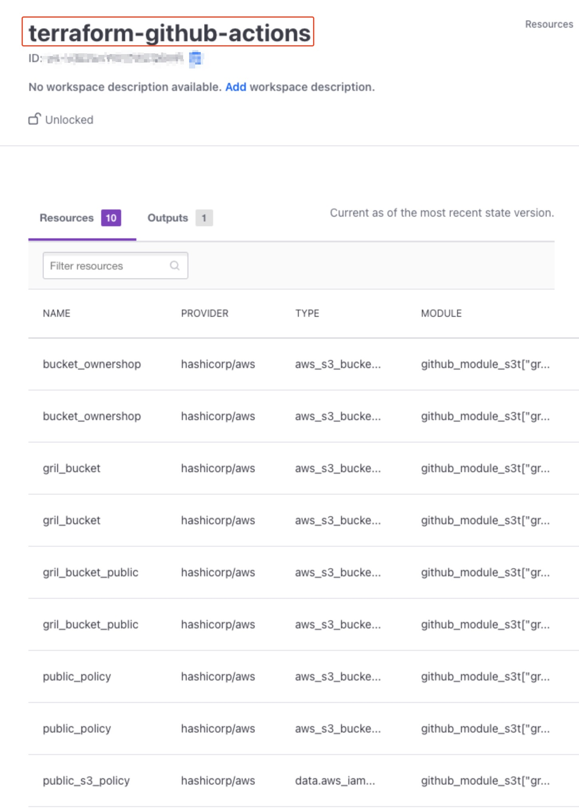
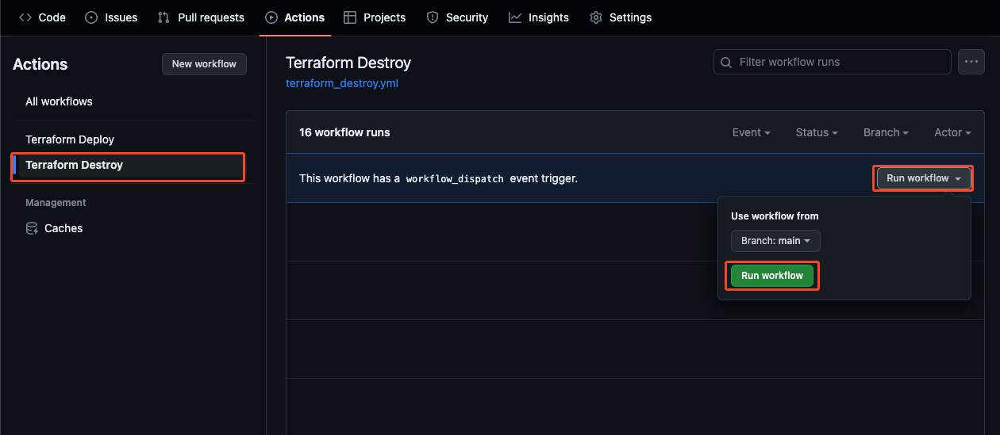
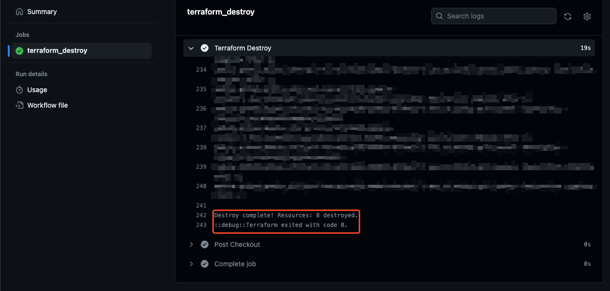

# Terraform 101 Study 7주차 정리 <!-- omit in toc -->

**Note:** 이 포스팅은 CloudNet@ 팀에서 진행하는 Terraform 101 Study의 7주차 내용을 정리한 글입니다.  

전체 소스 코드는 [GitHub](https://github.com/Gril-J/Terraform-101-Study)에서 확인 가능합니다.  

## 워크플로

Terraform 워크폴로는 **Write -> Plan -> Apply** 순으로 워크스페이스 별로 접근 권한을 관리하고 중앙에서 관리되는 실행 환경을 설계하여 규모에 맞는 워클플로 설계가 필요

**Write** : 프로비정닝하려는 목적에 따라 테라폼 코드를 작성

- 반복문을 사용할지 모듈화를 할지 고려
- 형상관리 도구와 브랜치 전략을 활용
- 로컬 환경과 배포 환경을 구조화 하여 디렉토리 기반 격리와 깃 기반 브랜치 전략 등을 활용

**Plan** : 적용하기 위한 실행 계획을 통해 리뷰

- 보안 취약성 점검 툴도 같이 활용
- 팀원 간 리뷰를 위해 공통 저장소에 병합

**Apply** : 코드로 실제 인프라를 프로비저닝

- 실제 프로비저닝 단계에서 오류가 발생할 여지가 있음
- 관리하는 단위를 나누는 기준은 조직 R&R, 서비스, 인프라 종류 등으로 구분

## 격리 구조

Terraform에서 동작 기준은 실행되는 루트 모듈에서 코드를 통합하고 하나의 State로 관리
모놀리식에서 MSA로 변화하는 과정에서 Iac 특성도 같이 달리지고 있음
모놀리식 방식이 인프라 프로비저닝 구축 속도가 빠를 수 있지만 MSA 같이 분산된 설계는 매몰 비용과 기술 부채를 줄일 수 있다.

### 루트 모듈 격리(파일/디렉터리)

- 편의성 및 배포 단수화를 위해 하나의 디렉토리에서 파일로 리소스들을 구분하거나 디렉터리를 생성하고 하위에 구성 파일 묶음을 위치시켜 루트 모듈에서 하위 디렉터리를 모듈로 읽는 구조를 사용  
- 루트 모듈 내의 리소스를 다수의 루트 모듈(디렉토리)로 분리하고 각 모듈의 State를 참조하도록 격리
- 작업자들의 관리 영역을 분리시키고 깃 기준의 리모트 저장소도 접근 권한을 관리하여 코드 충돌, 인수인계, 리뷰 영역 최소화 가능

### 환경 격리(브랜치 전략)

- 환경 간에 프로비저닝 되는 리소스와 브랜치를 연결하여 프로비저닝 환경과 리뷰 환경을 안정적으로 유지 가능
- 다수의 환경을 관리한다면 디렉토리 + 브랜치 별 리모트 구성을 권장

## Terraform + Github Action

**Terraform** : 4주차에서 활용한 모듈 코드
**State** : Terraform Cloud  
**GitHub Action** : init, plan, apply, destroy, tfscan, snayk  

1. GitHub에 Repo를 새로 하나 만 든 뒤 4주차에서 만든 코드를 원격 저장소에 `push` 합니다.  
2. 파이프라인 실행 과정에 필요한 민감 데이터를 Github Repo에 Secret에 저장합니다. 

   - [Setting] → [Secrets and variables - Actions]을 클릭
     - Name : TF_API_TOKEN
     - Secret : <각자 자신의 TFC Token>
   - 


3. Github Action을 작성하기 위해 로트 디렉터리에 `.github/wokflows` 폴더를 만듭니다.

   ```bash
   mkdir .github/wokflows
   cd .github/wokflows
   ```

4. Terraform 실행에 관련된 job을 정의하는 `terraform_deploy.yml`, 삭제에 관련된 job을 정의하는 `terraform_destroy.yml`을 만듭니다.

   ```bash
   touch terraform_deploy.yml
   touch terraform_destroy.yml
   ```

5. `terraform_deploy.yml`에 파이프라인이 실행되는 조건을 정의합니다.

   ```yaml
   name: 'Terraform Deploy'
   
   on:
     push:
       branches:
         - main
   ```

6. terraform plan job에 필요한 작업들을 정의 합니다.

   ```yaml
   jobs:
     # job 이름
     terraform_plan:
       runs-on: ubuntu-latest
       # Job이 실행될 때 생성되는 환경변수를 정의
       env:
         # Terraform Cloud ORG 이름
         TF_CLOUD_ORGANIZATION: "gril"
         # Terraform Cloud API Token
         TF_TOKEN_app_terraform_io: ${{ secrets.TF_API_TOKEN }}
         # Terraform Cloud Workspace
         TF_WORKSPACE: "terraform-github-actions"
         # AWS 자격증면 Token
         AWS_ACCESS_KEY_ID: ${{ secrets.AWS_ACCESS_KEY_ID }}
         AWS_SECRET_ACCESS_KEY: ${{ secrets.AWS_SECRET_ACCESS_KEY }}
   
       steps:
         # 현재 Repo Checkout
         - name: Checkout
           uses: actions/checkout@v2
         # 실행하는 Runner에 terraform cli 다운
         - name: Setup Terraform CLI
           uses: hashicorp/setup-terraform@v2
           with:
             terraform_version: 1.5.1
          # Terraform init 실행
         - name: Terraform init
           id: init
           run: terraform init
          # Teraform Plan 실행
         - name: Terraform Plan
           id: plan
           run: |
             terraform plan -input=false -out=terraplan
          # Plan 단계에서 생성된 파일 Artifact로 업로드
         - name: Plan File
           uses: actions/upload-artifact@v3
           with:
             name: plan
             path: terraplan
   ```

7. terraform test job에 필요한 작업들을 정의 합니다. terrascan과 snyk를 활용합니다.

   ```yaml
     terraform_test:
       runs-on: ubuntu-latest
       # terraform plan job이 실행되고 난 이후에 해당 job 실행
       needs: terraform_plan
       steps:
         # 현재 Repo를 checkout
         - name: Checkout
           uses: actions/checkout@v2
         # 이전 작업에서 저장한 Artifact 다운
         - name: Plan File
           uses: actions/download-artifact@v3
           with:
             name: plan
             path: terraplan
         # Terrascan 실행
         - name: Terrascan
           id: terrascan
           uses: tenable/terrascan-action@main
           with:
             iac_type: 'terraform'
             iac_version: 'v14'
             policy_type: 'aws'
             only_warn: true
             sarif_upload: true
         # Snyk 실행
         - name: SnykIac
           id: snyk
           uses: snyk/actions/iac@master
           env:
             # Snyk 실행에 필요한 API Token 환경변수 정의
             SNYK_TOKEN: ${{ secrets.SNYK_TOKEN }}
   ```

8. terraform apply job에 필요한 작업들을 정의 합니다.

   ```yaml
     terraform_apply:
       runs-on: ubuntu-latest
       # terraform test job이 실행되고 난 이후에 해당 job 실행
       needs: terraform_test
       # Job이 실행될 때 생성되는 환경변수를 정의
       env:
         TF_CLOUD_ORGANIZATION: "gril"
         TF_TOKEN_app_terraform_io: ${{ secrets.TF_API_TOKEN }}
         TF_WORKSPACE: "terraform-github-actions"
         AWS_ACCESS_KEY_ID: ${{ secrets.AWS_ACCESS_KEY_ID }}
         AWS_SECRET_ACCESS_KEY: ${{ secrets.AWS_SECRET_ACCESS_KEY }}
       steps:
          # 현재 Repo Checkout
         - name: Checkout
           uses: actions/checkout@v2
          # 실행하는 Runner에 terraform cli 다운
         - name: Setup Terraform CLI
           uses: hashicorp/setup-terraform@v2
           with:
             terraform_version: 1.5.1
          # Terraform init 실행
         - name: Terraform init
           id: init
           run: |
             terraform init
          # Terraform apply 실행
         - name: Terraform Apply
           id: apply
           run: |
             terraform apply -auto-approve
   ```

9. `terraform_destroy.yml`에 파이프라인이 실행되는 조건을 정의합니다.

   ```yaml
   name: 'Terraform Destroy'
   
   on:
     # "Terraform Deploy" 워크플로가 완료된 후에 실행
     workflow_run:
       workflows:
         - "Terraform Deploy"
       types:
         - completed
     # 자동으로 실행되지 않고 수동으로 실행
     workflow_dispatch:
   ```

10. terraform destroy job에 필요한 작업들을 정의 합니다.

    ```yaml
    jobs:
      terraform_destroy:
        runs-on: ubuntu-latest
        # Job이 실행될 때 생성되는 환경변수를 정의
        env:
          TF_CLOUD_ORGANIZATION: "gril"
          TF_TOKEN_app_terraform_io: ${{ secrets.TF_API_TOKEN }}
          TF_WORKSPACE: "terraform-github-actions"
          CONFIG_DIRECTORY: "./"
          AWS_ACCESS_KEY_ID: ${{ secrets.AWS_ACCESS_KEY_ID }}
          AWS_SECRET_ACCESS_KEY: ${{ secrets.AWS_SECRET_ACCESS_KEY }}
        steps:
           # 현재 Repo Checkout
          - name: Checkout
            uses: actions/checkout@v2
           # 실행하는 Runner에 terraform cli 다운
          - name: Setup Terraform CLI
            uses: hashicorp/setup-terraform@v2
            with:
              terraform_version: 1.5.1
           # Terraform init 실행
          - name: Terraform init
            id: init
            run: terraform init
           # Terraform destroy 실행
          - name: Terraform Destroy
            run: terraform destroy -auto-approve
    ```

11. 원격 저장소에 `push`하여 코드를 업로드 함과 동시에 파이프라인 실행 동작을 확인 합니다.

    - Terraform Deploy 확인
      
      - terraform plan Job 확인
      
      - terraform test job 확인
      
      
      - terraform apply job 확인
      
    - Terraform Cloud State 확인
      
    - Terraform Destroy 실행
      
      - terraform destroy job 확인
        